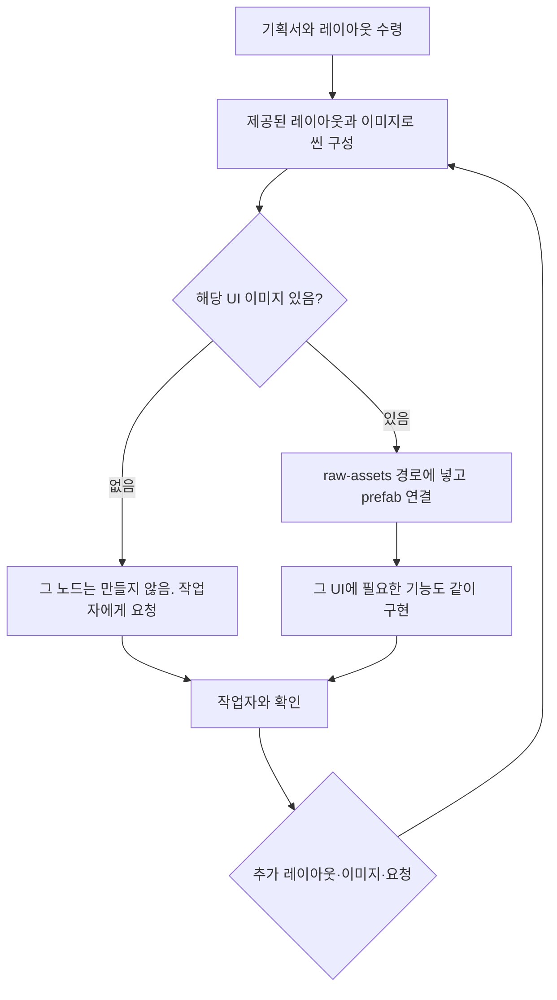

# 제작 진행

작업자와 막히거나 선택이 필요할 때만 묻는다. 기술 선택지는 기본값을 쓴다.

## 시작 조건

템플릿 포크 프로젝트 + 기획서 + 레이아웃. 이미지는 처음부터 전부 없어도 된다.

작업자가 디자인 가이드 등 다른 md를 같이 줄 수 있다. HTML 금지·intro·번들/경로는 이 문서가 이긴다. 이미 있는 UI는 요청 없이 유지한다. 새 입력은 기획서 형태, 없으면 `InputField`. 다른 가이드에만 있는 비주얼 지시(톤, 여백, 카피)는 그대로 쓴다.

## 루프



한 턴에서 하는 일:

1. 작업자가 준 **전체 화면 레이아웃**으로 노드 위치·크기를 잡는다. AI가 화면을 새로 그리지 않는다. 배치는 prefab 또는 게임 씬에 두고, 스크립트에서 UI를 조립하지 않는다. 나누고 묶는 방식은 [scene-structure.md](scene-structure.md). 이 저장소 HUD를 복사하지 않는다. 이미 있는 UI는 요청 없이 바꾸지 않는다. 새 입력은 기획서 형태, 없으면 `InputField`. 좌표는 레이아웃 그룹이 못 잡는 앵커에만 쓴다.
2. 위치는 `layout.md`에 적되, 작업자 레이아웃에서 잰다.
3. 작업자가 준 **UI 이미지**만 kebab-case로 `raw-assets/{bundle}/images/{atlas}/`에 복사하고 prefab `image`에 연결한다.
4. `screen-*.png` 같은 레이아웃 원본은 에셋으로 쓰지 않는다. 오리지 않는다.
5. 이미지가 아직 없는 UI는 **노드를 만들지 않는다.** 채팅에서 어떤 파일이 필요한지 짧게 요청하고, 있는 레이아웃·이미지로만 씬을 이어 간다.
6. 그 조각에 필요한 클라이언트·로컬 서버 기능도 같이 붙인다. 한 번에 게임 전체를 설계하지 않는다.
7. 에셋이 바뀌었고 작업자가 개발 서버로 확인할 수 있으면, 실행 **전에** `npm run build:assets:dev`를 한다.

## 개발 서버로 확인

작업자는 개발 서버로 중간 결과를 본다. 이미지·prefab·씬·사운드 등 `raw-assets`가 바뀌었으면 **실행 전에** 개발용 에셋을 빌드한다.

```
npm run build:assets:dev
```

에셋 변경 없이 스크립트만 고친 경우에는 이 빌드를 건너뛴다. 에셋이 바뀌었는데 빌드 없이 실행하면 화면이 깨지거나 안 뜬다.

## 이미지

- **생성하지 않는다.** 시안·단독 스프라이트·마스터 1080×1920 생성 금지.
- 받은 PNG만 넣는다. 파일명은 kebab-case (`btn-bet.png`).
- 같은 모양은 같은 파일을 가리킨다.
- 고정 글자는 스프라이트 그대로. 바뀌는 숫자만 Text.
- `common/images/loading/white_box.png`는 템플릿 로딩용이다. 게임 UI에 쓰지 않는다.
- 사운드·폰트·Spine은 작업자 파일이 오기 전에 템플릿 기본(폰트 등)만 쓴다. 나중에 같은 경로에 덮어쓸 수 있다.

없는 이미지를 요청할 때 짧게:

```
BtnBet 이미지가 없어 노드는 만들지 않았습니다.
필요 파일: btn-bet.png (권장 아틀라스 game/images/ui/)
```

## 레이아웃 → 좌표

작업자 레이아웃(이미지 또는 설명)에서 위치·크기를 잰다. `layout.md` 예:

```
## 대기
- BtnBet: pos 540,1680 size 280×88  pivot 0.5,0.5
- BetAmount: pos 540,1580  font 36
```

레이아웃에 없는 배치는 추측하지 않고 묻는다.

## 기능 병행

버튼을 씬에 넣을 때 Container를 먼저 만들고 `Button`/`State*`를 그 위에 붙인다. 슬라이더·입력필드도 Container 루트에 `Slider`/`InputField`를 붙이고, Track/Fill/Frame 이미지는 하위 Sprite다. `StateSize`·pivot·필요하면 클릭→`REQ_BET`까지 같은 작업에서 다룬다.

- 씬 정리 원칙은 [scene-structure.md](scene-structure.md)
- 씬 계층·버튼 트리는 [scene.md](scene.md)
- 에셋 경로·번들은 [assets.md](assets.md)
- 연출은 [fx.md](fx.md)
- 로컬 서버는 [local-server.md](local-server.md)
- 클라이언트는 [client.md](client.md)

기획서에 없는 룰·페이로드는 추측하지 않고 묻는다. 요청하지 않은 보드·오토플레이 전체를 한 번에 짜지 않는다.

## intro 공용 팝업

다음 이름은 intro에만 있다. 레이아웃·이미지·prefab으로 다시 만들지 않는다.

`Tutorial` / `HowToPlay` / `BetHistory` / `FreespinStart` / `FreespinEnd` / `CommonPopup`

## 하지 말 것

- 페이즈 번호·게이트를 말하기
- 다른 가이드 md가 이 스킬과 다를 때 다른 가이드를 따르기
- 이미지를 생성하기
- 레이아웃 원본을 잘라 `raw-assets`에 넣기
- 이미지 없는 UI를 빈 상자/`white_box`로 자리 잡기
- POC·레이아웃 좌표를 평평한 트리로 옮기기. 나열은 LayoutGroup / ScrollRect ([scene-structure.md](scene-structure.md))
- 이미 있는 UI를 작업자 요청 없이 `InputField` 등으로 교체하기
- 한 `.ts`에 `@RegisterComponent`를 두 개 이상 두기
- 템플릿 기본 스크립트 수정 (`local_server` 등 허용 목록 제외)
- `intro.prefab` 시스템 트리 변경
- Sprite(이미지)에 `Button` / `Toggle` / `Slider` / `InputField` / `State*`를 붙이기
- pixibrown 시리얼라이즈 타입을 `as`로 바꿔 import 하기 (`Number as SerializeNumber`). 기본 `Number`/`String`/`Boolean`이 필요하면 그 이름을 pixibrown에서 import 하지 말 것
- prefab/씬 없이 스크립트에서 UI를 만들고 좌표를 배치하기 (작업자가 그 방식을 직접 지시한 경우만 예외)
- 에셋 변경 후 `npm run build:assets:dev` 없이 개발 서버/프로젝트 실행하기
