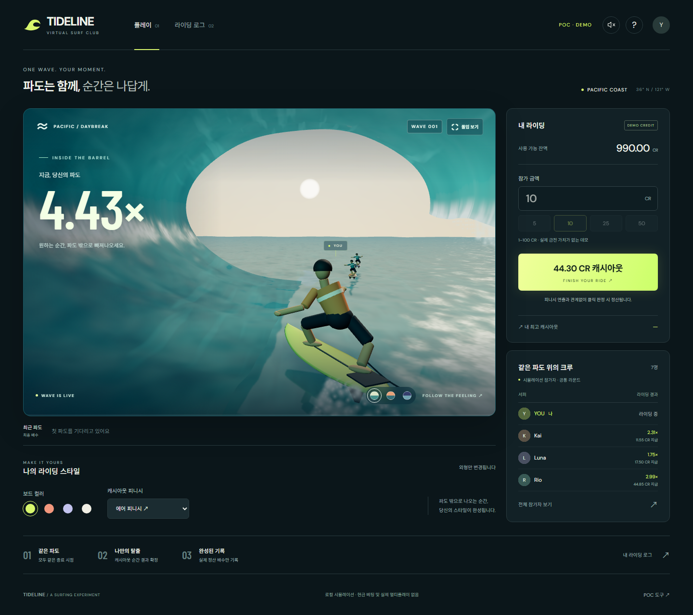

# TIDELINE — Surfing POC

파도를 함께 타고, 원하는 순간에 캐시아웃하는 서핑 크래시 게임의 독립 실행형 POC입니다.

> 현재 구현은 데모 CR을 사용하는 브라우저 로컬 시뮬레이션입니다. 실제 금전 거래·실제 멀티플레이·상용 RTP 인증은 포함하지 않습니다.



## 실행

Node.js 22 이상(검증 환경: Node.js 24)을 사용합니다.

```sh
npm ci
npm run dev
```

[로컬 미리보기](http://127.0.0.1:4187)를 엽니다. 다른 포트가 필요하면 `PORT` 환경변수를 지정합니다.

## 빌드와 검증

```sh
npm run check
npm run preview
```

- `check`: JavaScript 구문 검사 → 정산 단위·회귀 테스트 21개 → 정적 빌드.
- `build`: `dist/`에 배포 가능한 정적 파일 생성.
- `preview`: `dist/`를 4187 포트에서 제공. 개발 서버와 동시에 실행하려면 포트를 다르게 지정합니다.
- GitHub Actions: main push 및 PR에서 단위 테스트·브라우저 QA 후 `surfing-poc-dist` 빌드 아티팩트를 저장합니다. main에서는 검증된 `dist/`를 GitHub Pages에 자동 배포합니다. PR은 배포하지 않습니다.

브라우저 검증은 미리보기 서버가 실행된 상태에서 별도 터미널로 수행합니다.

```sh
npx playwright install chromium
npm run test:browser
```

PC 1440px·모바일 390px에서 참가·취소·캐시아웃·개인 최고·로그·테마·피니시·전체 크루·도움말·즉시 크래시·새로고침 복원·가로 넘침·모바일 고정 버튼을 확인합니다. 캡처는 `tests/artifacts/`에 저장됩니다.

## 확대 QA

Chromium·Firefox·WebKit에서 320/360/390/520/768/1024/1440px를 검사합니다. 브라우저 3종을 설치한 뒤 `npm run test:qa`를 실행하면 검수 서버가 자동으로 시작·종료됩니다. 자세한 범위와 수정 결과는 [POC QA 보고서](doc/poc-qa-report.md)를 참고하세요.

추가 연출 검수는 `npm run test:visual`로 실행합니다. 3개 테마·피니시, PC·모바일 구도, 연출 중 정산 보존, 다음 라운드 복귀, 모션 감소 설정을 검사하고 `tests/artifacts/visual/`에 캡처를 저장합니다. [배럴 카메라 구현·검수](doc/barrel-camera.md)를 참고하세요.

3D 렌더링과 그래픽 복구 검수는 `npm run test:graphics`로 실행합니다. [3D 코어 장면](doc/three-dimensional-scene.md)에 구조·성능·검수 범위를 정리했습니다.

## 구현 범위

- 공통 파도: 대기 → 라이딩 → 크래시 → 다음 대기.
- Three.js 3D 배럴·물 셰이더·수면 반사·관절 서퍼, 추적 카메라와 3종 탈출 피니시.
- 장면을 확대하는 몰입 보기, WebGL 미지원·연결 손실 시 Canvas 호환 장면.
- 데모 잔액, 출발 전 참가 취소, 중복 지급을 막는 캐시아웃.
- 시뮬레이션 크루 6명과 실시간 결과 리스트·전체 보기.
- 실제 정산 배수 기반 개인 최고 카드, 최근 100건 라이딩 로그.
- 새벽·노을·달빛 테마, 보드 4색, 선택적 사운드.
- 모바일 라이딩 중 하단 고정 캐시아웃 버튼.
- POC 도구의 즉시 종료·짧은 파도·긴 파도 시나리오와 잔액 초기화.

친구 계정, 실제 서버, 리플레이·클립 저장은 후속 범위입니다. 일반 데모는 0.99 계수를 참고한 분포를 사용하지만 절삭·최소값·상한이 있는 POC 시연 규칙이며, 최종 RTP 99%를 보장하지 않습니다.

## 제작 기준과 다음 단계

사용자 지시에 따라 템플릿 승인 전에는 POC를 먼저 완성하고, 이후 제공된 가이드대로 PixiBrown·SceneMaker로 전환합니다. 현재의 HTML/CSS·Three.js 3D 및 Canvas 호환 장면은 POC용입니다.

| 문서 | 역할 |
| --- | --- |
| [서핑 기획](SURFING_GAME_DESIGN.md) | 콘셉트, 연출, 기록 비교 및 POC 범위 |
| [현재 개발 기준](doc/surfing-development.md) | 사용자 지시, 적용 범위, 구조, 데모 규칙 |
| [PixiBrown 전환 계획](doc/pixibrown-migration.md) | 최종 템플릿으로 옮길 책임과 보존할 행동 |
| [제작 파이프라인](doc/skills/SKILL.md) | 템플릿 확보 이후 적용할 제작 규칙 |
| [공통 디자인 가이드](doc/design/00_공통가이드_인덱스.md) | 색·타이포·레이아웃·연출 참고 |

`doc/design`의 Massive Mines·Avi-Cluck·Dice/Limbo 내용은 해당 게임의 예시이며, 서핑의 확정 규칙이 아닙니다.

## 저장 및 배포

기록·잔액·외형 설정은 브라우저 localStorage에 저장됩니다. 미정산 참가 상태에서 새로고침하면 해당 참가금이 복원됩니다. 캐시아웃은 즉시 저장되며, 종료 전에 페이지를 떠난 파도의 최종 배수는 “종료 미확인”으로 표시합니다. 실제 서버 재접속 정책은 템플릿 전환 시 구현해야 합니다.

Three.js 0.186.0 런타임을 압축해 빌드에 포함합니다. 폰트와 해당 라이선스는 빌드에 함께 포함되며, 외부 폰트 서버 연결 없이 실행됩니다. 정적 호스팅에는 `dist/` 전체를 사용하고, 파일을 직접 더블클릭하는 대신 HTTP 서버에서 실행합니다.

공개 POC: [TIDELINE 플레이](https://moonddu-star.github.io/surfing/)

GitHub 저장소의 Settings → Pages → Source는 **GitHub Actions**를 사용합니다. 저장소 원본에는 빌드 시 생성되는 폰트가 없으므로 main 브랜치의 루트를 직접 게시하지 않습니다.

저장소: [moonddu-star/surfing](https://github.com/moonddu-star/surfing)
